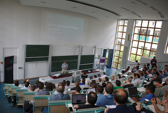
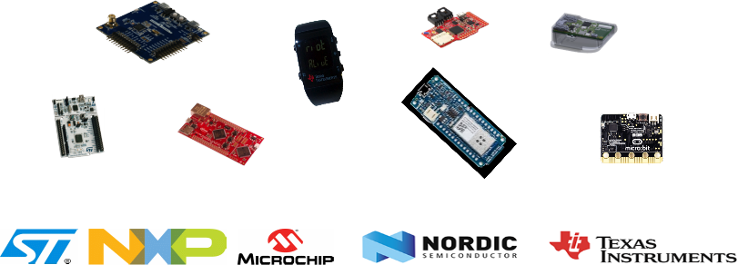
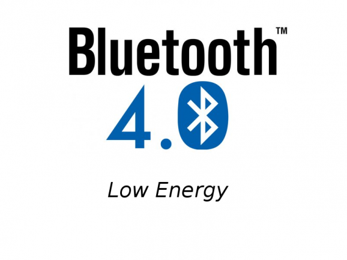

class: inverse, center, middle


<br/>
<br/>
<br/>

# IoT con RIOT OS
## Clase 01
### Leandro Lanzieri | José Álamos
16.06.2020

<br/>
<br/>
<br/>

---

## ¿Qué es RIOT?

- **Sistema operativo** para microcontroladores

 - **arquitectura de microkernel** &#x21d2; requiere muy pocos recursos
 - **tiempo real** y **multi-threaded**
 - incluye **stack de red propios**

<br>

- **código abierto**: <a href="https://github.com/RIOT-OS/RIOT">https://github.com/RIOT-OS/RIOT</a>

 - plataforma de software libre
 - **comunidad global** de desarrolladores

<br>

- **fácil de utilizar** y _reutilizar_

 - Programación estándar en C
 - Herramientas estándares
 - **La API es independiente** del hardware

<br><br>

---

### RIOT en el mundo de IoT

.center[
<br/><br/>
<br/><br/>
&#x21d2; RIOT está diseñado para dispositivos 'low-end'
<br>(kB RAM, MHz, mW)
]

---

## Historia del proyecto

- 2013: Inria, FU Berlin y HAW Hamburg fundaron RIOT

 - parte de un proyecto de investigación entre Francia y Alemania
 - el kernel evolucionó del FireKernel

- La comunidad hoy:

  - Hasta ahora, **+200** contribuidores en la rama master
  - Académicos: Berkeley, UCLA, MIT, AIT, TZI, etc
  - Industriales: Cisco, Samsung, ImgTec, Fujitsu, Thalès
  - PyMEs: Zolertia, OTAKeys, Mesotic, Eistec, We-sens
  - Miembro de la iniciativa EdgeXFoundry

- RIOT Summit anual: https://summit.riot-os.org

.center[
&nbsp;

]

---

class: inverse, center, middle

# Visión técnica general

<br/>
La historia corta: publicación en IEEE Internet of Things Journal<br/>
Disponible en: http://riot-os.org/files/2018-IEEE-IoT-Journal-RIOT-Paper.pdf

---

## Características del OS

- Arquitectura basada en **micro-kernel**: diseñado modularmente

- Binario de pequeño tamaño <br> &#x21d2; **2.8kB** RAM, **3.2kB** ROM en
  32-bit Cortex-M

- Scheduler de **tiempo real**
  - &#x21d2; preempción con prioridades fijas y operaciones O(1)
  - &#x21d2; scheduler tickless

- **Multi-thread** e IPC:
  - Contextos separados de threads con stacks de memoria separados
  - Bloque de Control de Thread (TCB) mínimo
  - Sincronización de threads utilizando mutex, semáforos y mensajes.

---

## Múltiples threads

2 threads por defecto:

- el thread `main`: ejecuta la función `main`

- el thread `idle`:

  - mínima prioridad <br/>&#x21d2; thread que corre cuando las demás están bloqueadas o terminaron
  - pasa el sistema a modo de bajo consumo

El contexto de interrupción (ISR) controla los eventos externos y notifica a los
threads utilizando mensajes IPC (Inter Process Communication).

.center[
    
]

---

## Capa de abstracción de hardware

- Dividida en 3 bloques: boards, cpus, drivers

- Los CPUs están organizados de la siguiente manera:
**arquitectura** (ARM) > **familia** (stm32) > **tipo** (stm32l4) > **modelo** (stm32l476rg)

- API genérica para los periféricos del CPU (gpio, uart, spi, pwm, etc.)

    &#x21d2; la misma API para todas las arquitecturas

- Sólo basadas en los headers del fabricante (CMSIS) &#x21d2; implementación
  desde cero

    &#x21d2; menos duplicación de código, más eficiencia, más trabajo

- Una aplicación &#x21d2; una placa &#x21d2; un modelo de CPU

.center[
    
]

---

## Soporte de hardware

- **Capa de abstracción de hardware:** soporte para 8/16/32 bit, ARM, AVR, MIPS

- Fabricantes soportados: Microchip, NXP, STMicroelectronics, Nordic, TI, ESP, RISC-V, etc.

- **Gran lista de sensores y actuadores** soportados (e.g. drivers)

- Placa _native_: **corre RIOT como un proceso en tu PC**

- **+100 placas soportadas**

.center[
    
]

---

## Un OS modular

Las funcionalidades son provistas como módulos &#x21d2; **sólo se compila lo que se requiere**

- Bibliotecas de sistema: **xtimer**, **shell**, crypto, etc.

- Sensores y actuadores

- Drivers de pantallas, sistemas de archivos, etc.


- Intérpretes embebidos: JavaScript, MicroPython, LUA

- Protolos de red de alto nivel: CoAP, MQTT-SN, etc.

- Paquetes externos

.center[

]

---

## Paquetes externos

- RIOT puede ser extendido con paquetes externos

- Integrados (y eventualmente modificados) mientras se compila la aplicación

- Fáciles de agregar: sólo requieren 2 `Makefiles`

- Ejemplos de paquietes: lwIP, OpenThread, lvgl, loramac, etc.

<br/><br/>

.center[
    
]

---

## Stacks de red

**Stacks orientados a IP** &#x21d2; diseñados para redes Ethernet, WiFi, 802.15.4

- **GNRC**: el stack 802.15.4/6LoWPAN/IPv6 propio de RIOT

- **Thread**: Stack 802.15.4 IPv6 provisto por el ThreadGroup

.center[
    
]

- **OpenWSN** (experimental): una capa MAC determinística que implementa el
   protocolo IEEE 802.15.4e TSCH

.center[
    
]

- Otros stacks IPv6

  - **lwIP**: Un stack de red completo diseñado para bajo consumo de memoria

  - **emb6**: Un fork del stack de red de Contiki que puede ser utilizado sin proto-threads

---

## Otros soportes de red

- Controller Area Network (**CAN**) propio

- Soporte para stack **BLE**: <a href="https://github.com/apache/mynewt-nimble">NimBLE</a>

<br><br>

- GNRC **LoRaWAN** stack
&#x21d2; Compatible con LoRaWAN 1.0.3

<br><br>

- Soporte de **SigFox** para los módulos ATA8520e


---

## Otras características importantes

- Stack USB completo (CDC-ACM, CDC-ECM, etc.)


<br/><br/>

- Actualización estándar y segura de software

.center[https://datatracker.ietf.org/wg/suit/about/]

---

class: center, middle

# Empezamos

---

## Estructura de una aplicación de RIOT

Una aplicación de RIOT mínima consiste de:

- Un `Makefile`

```mk
APPLICATION = example

BOARD ?= native

RIOTBASE ?= $(CURDIR)/../../../RIOT

DEVELHELP ?= 1

include $(RIOTBASE)/Makefile.include
```

- Un archivo C que contiene la función `main`

```c
#include <stdio.h>

int main(void)
{
    puts("Mi primera aplicacion de RIOT");
    return 0;
}
```

---

## Compilar una aplicación de RIOT

- El sistema de compilación de RIOT está basado en la herramienta de compilación
  **make**

- Para compilar una aplicación, **make** puede ser invocado de 2 maneras:

  - Desde el directorio de la aplicación
    ```sh
  $ cd <directorio_de_aplicacion>
  $ make
  ```

  - Desde cualquier lugar, utilizando `-C` para especificar el directorio de la
    aplicación:
  ```sh
  $ make -C <directorio_de_aplicacion>
  ```

---

## Compilar una aplicación de RIOT

- Usa la variable **BOARD** para especificar el objetivo (la placa) en tiempo de
  compilación
```sh
$ make BOARD=<placa> -C <directorio_de_aplicacion>
```
`BOARD` puede ser cualquier placa soportada por RIOT<br/>
&#x21d2; ver el directorio **RIOT/boards** para la lista completa

- Usa la variable **RIOTBASE** para especificar el directorio base de RIOT

---

## Correr una aplicación de RIOT

Esto depende de la placa objetivo:

- Correr en **native**: la aplicación de RIOT es ejecutada como un proceso de
  Linux
```sh
$ make BOARD=native -C <directorio_de_aplicacion>
$ <directorio_de_aplicacion>/bin/native/aplicacion.elf
```

- Correr en **hardware**: la aplicación de RIOT debe ser *programada* primer en
  la placa

&#x21d2; usar los objetivos de make **flash** y **term**
  - **flash**: compila y escribe el firmware en la memoria flash del MCU

  - **term**: abre un cliente de terminal conectado al puerto serie de la placa

Todo esto puede hacerse en un solo comando:

```sh
$ make BOARD=<placa> -C <directorio_de_aplicacion> flash term
```

---

## Ejercicio: primera aplicación de RIOT

Compilemos y corramos nuestra primera aplicación de RIOT <br/><br/>
Seguir las instrucciones del README <br/>
`exercises/getting-started/first-app/README.ES.md`

```sh
$ cd ~/riot-course/exercises/getting-started/first-app
$ make
Building application "example" for "native" with MCU "native".

"make" -C /home/user/RIOT/boards/native
"make" -C /home/user/RIOT/boards/native/drivers
"make" -C /home/user/RIOT/core
"make" -C /home/user/RIOT/cpu/native
"make" -C /home/user/RIOT/cpu/native/periph
"make" -C /home/user/RIOT/cpu/native/vfs
"make" -C /home/user/RIOT/drivers
"make" -C /home/user/RIOT/drivers/periph_common
"make" -C /home/user/RIOT/sys
"make" -C /home/user/RIOT/sys/auto_init
 text   data  bss    dec    hex   filename
 20206  568   47652  68426  10b4a .../getting-started/first-app/bin/native/example.elf
```

---

## ¿Cómo extender la aplicación?

&#x21d2; agregando módulos al `Makefile` de la aplicación, o desde la línea de comandos:

- Agregar módulos extra con **USEMODULE**<br/>
     &#x21d2; `xtimer`, `fmt`, `shell`, `ps`, etc.

- Incluir paquetes externos con **USEPKG**<br/>
    &#x21d2; `lwip`, `semtech-loramac`, etc.

- Utilizar drivers de periféricos del MCU con **FEATURES_REQUIRED**<br/>
    &#x21d2; `periph_gpio`, `periph_uart`, `periph_spi`, `periph_i2c`

---

## Formas de agregar módulos a la aplicación

Ejemplo en un `Makefile`:
```mk
USEMODULE += xtimer shell

USEPKG += semtech-loramac

FEATURES_REQUIRED += periph_gpio
```

Ejemplo desde la línea de comandos:
```sh
$ USEMODULE=xtimer make BOARD=pba-d-01-kw2x
```

---

## Ejercicio: escribir una aplicación con un shell

Seguir las instrucciones del README en <br/>
`exercises/getting-started/shell/README.ES.md`.

---

## Interacción con el hardware

La interacción con el hardware puede realizarse en 3 niveles:

- A nivel de placa, utilizando macros pre-definidas para controlar LEDs y botones

  &#x21d2; sólo hay que incluir `board.h` para utilizarlas

- A nivel de CPU, utilizando las APIs de los drivers para periféricos del MCU

  &#x21d2; periph_gpio,periph_i2c, periph_uart, etc.

  Este nivel es considerado como la **HAL** (capa de abstracción de hardware -
  _hardware abstraction layer_) de RIOT, ya que provee una API común para todos
  los tipos/arquitecturas de CPU

- A nivel de driver utilizando APIs de alto nivel para sensores, actuadores o
  radios específicos

  &#x21d2; bmp180, hts221, sx1276, etc.

---

## Ejercicio: interacción con el hardware

- Seguir las instrucciones del README del ejercicio de LEDs
  `exercises/getting-started/led`, para cambiar el estado de los mismos por comandos de
  shell.

- Seguir las instrucciones del ejercicio de sensor
  `exercises/getting-started/sensor`, para leer valores de un sensor con
  comandos de shell.

---

## Próximos pasos: leer el código de aplicaciones existentes

El directorio de RIOT contiene aplicaciones que pueden ser utilizadas como
ejemplos para la mayoría de las características que provee.

- Ver aplicaciones en el directorio `examples`

- Probar las aplicaciones en el directorio `tests`, que también provee buenos
  ejemplos para comenzar en RIOT.

---

## Resumen

- Compilar y correr una primera aplicación de RIOT, en native y en hardware

- ¿Cómo extender una aplicación?, el `shell`

- Interacción básica con el hardware

- Leer valores de sensores
